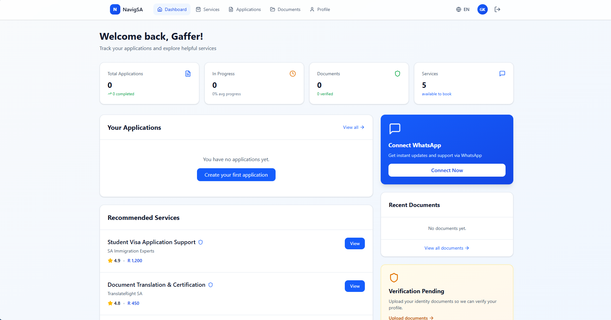

# NavigSA — Multilingual Student Support Platform

Applying to a South African university from abroad means juggling deadlines,
document requirements, and translation services across half a dozen websites —
usually in a second or third language. NavigSA puts that in one place.

International students track their applications, upload and store documents
securely, and find verified service providers, in **English, Portuguese, French,
or Spanish**.

**Live:** https://multilingual-student-platform-navig.vercel.app



---

## Features

| | |
|---|---|
| **Accounts** | Email/password signup with confirmation, login, password reset, session persistence |
| **Onboarding** | Three-step profile setup — personal details, ID verification info, study preferences |
| **Dashboard** | Live application counts, progress averages, recent documents, verification status |
| **Applications** | Create, track, filter, and delete university applications with deadlines, requirement counts, and progress |
| **Documents** | Drag-and-drop upload to private storage, filter by status, view via expiring signed URLs, delete |
| **Marketplace** | Browse verified providers by category — translation, visa, accommodation, tutoring, legal |
| **Profile** | Edit details, change password, set notification and study preferences |
| **Multilingual** | EN / PT / FR / ES, switchable anywhere; your choice is saved to your profile |

## Tech stack

**Frontend** — React 18, TypeScript, Vite 6, React Router 7, Tailwind CSS 4, shadcn/ui, lucide-react

**Backend** — Supabase (PostgreSQL, Auth, Storage) with Row Level Security

**Hosting** — Vercel, auto-deploying on push

---

## Quick start

**Requirements:** Node 18+ and a free [Supabase](https://supabase.com) account.

```bash
npm install
```

```bash
cp .env.example .env.local
```

Fill in `.env.local` with your Supabase project URL and anon key
(**Project Settings → API**):

```
VITE_SUPABASE_URL=https://your-project-ref.supabase.co
VITE_SUPABASE_ANON_KEY=your-anon-key
```

Then run the three migrations in `supabase/migrations/` — paste each into the
Supabase **SQL Editor** and run them **in order**. `0001` creates the tables,
`0002` adds security policies and the storage bucket, `0003` seeds the
marketplace.

```bash
npm run dev
```

Open http://localhost:5173. If you see an amber *"Supabase not connected"*
banner, your keys aren't loaded — Vite only reads `.env.local` at startup, so
restart the dev server after editing it.

Step-by-step walkthrough, including where each setting lives in the Supabase
dashboard: **[SUPABASE_SETUP.md](SUPABASE_SETUP.md)**.

## Scripts

| Command | What it does |
|---|---|
| `npm run dev` | Dev server with hot reload |
| `npm run build` | Production build into `dist/` |
| `npm run typecheck` | `tsc --noEmit` — **Vite only transpiles and never checks types, so run this separately** |

---

## Data model

Four tables, all owned by the signed-in user except `services`:

```
profiles       one row per auth user, created automatically by a signup trigger
applications   university applications, with progress and requirement counts
documents      file metadata; the file itself lives in Storage
services       the provider marketplace — shared catalogue, read-only to users
```

## Security

Row Level Security is enabled on every table. The anon key in the browser can
only read or write rows where `user_id` matches the authenticated user — there
is no query that returns another student's data, regardless of what the client
asks for.

Uploaded files are stored under `<user-id>/<filename>` in a **private** bucket,
and the storage policies pin that first path segment to `auth.uid()`. One
student cannot reach another's documents even with a guessed path. Files are
served through short-lived signed URLs rather than public links, and the bucket
rejects anything over 10 MB or outside PDF/JPG/PNG.

Two fields are deliberately **not** meant to be self-serve, since a student
shouldn't be able to approve their own paperwork:

- `documents.status`
- `profiles.verification_status`

Both are set by a reviewer using the `service_role` key server-side. Migration
`0004` enforces this with Postgres column privileges, so a signed-in student
cannot approve their own documents or mark themselves verified even by calling
the database directly from the console. See
[SUPABASE_SETUP.md](SUPABASE_SETUP.md#security-model).

> **Never put the `service_role` key in this project.** Anything in a `VITE_`
> variable is compiled into the JavaScript bundle your visitors download, and
> that key bypasses every policy above.

---

## Project layout

```
src/
  lib/
    supabase.ts          client + "are the keys actually set?" guard
    api.ts               every database and storage call
    database.types.ts    table types
    useAsyncData.ts      fetch-on-mount hook with loading/error state
  app/
    contexts/
      AuthContext.tsx    session, profile, sign in/up/out
      LanguageContext.tsx  translations
    components/
      ProtectedRoute.tsx route guard
      Navigation.tsx
      ui/                shadcn/ui primitives
    pages/               Login, Onboarding, Dashboard, Marketplace,
                         Applications, Documents, Profile
supabase/
  migrations/            run in order in the Supabase SQL editor
```

## Deployment

Pushes to `supabase-integration` auto-deploy to Vercel.

Two things any host needs:

1. **`VITE_SUPABASE_URL` and `VITE_SUPABASE_ANON_KEY` set before the build
   runs.** Vite inlines env vars at build time, so adding them afterwards does
   nothing until you redeploy.
2. **SPA rewrites**, so a refresh on `/dashboard` doesn't 404. Handled here by
   [`vercel.json`](vercel.json); on Netlify you'd add `/* /index.html 200` to a
   `public/_redirects` file.

After deploying, add the production URL to Supabase under **Authentication →
URL Configuration**, or confirmation and password-reset emails will point at
`localhost`.

---

## Not yet implemented

Honest list of what's still UI-only:

- **Reviewer workflow** — no admin interface for marking documents verified or
  rejected; the schema supports it but it has to be done from the Supabase
  dashboard
- **Provider contact** — the marketplace *Contact* button and the favourite
  (heart) toggle aren't wired up
- **WhatsApp integration** — *Connect Now* on the dashboard is a placeholder
- **Two-factor auth** — Supabase supports TOTP, the enrolment flow isn't built
- **Support contact** — the Profile page button is a placeholder

## Credits

Interface originally generated with [Figma Make](https://www.figma.com/make/);
forked from
[RISTechnologies01/Multilingual-Student-Platform-NavigSA-](https://github.com/RISTechnologies01/Multilingual-Student-Platform-NavigSA-)
and extended with the Supabase backend, authentication, and data layer.

Component primitives from [shadcn/ui](https://ui.shadcn.com) (MIT); photography
from [Unsplash](https://unsplash.com/license). See
[ATTRIBUTIONS.md](ATTRIBUTIONS.md).
